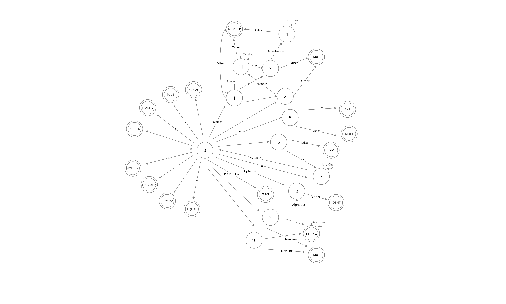

# Lexical Analysis

## CSCI 203 - Theory of Automata and Formal Languages
## PROJECT - Lexical Analysis   

Lexical Analysis is the first phase of the compiler also known as a scanner. It converts the High level input program into a sequence of Tokens. Lexical Analysis can be implemented with the Deterministic finite Automata. The output is a sequence of tokens that is sent to the parser for syntax analysis.

The image below is the automaton that is used in the project. We have numerous token like numbers, string, exponential, division, identifier and etc.

